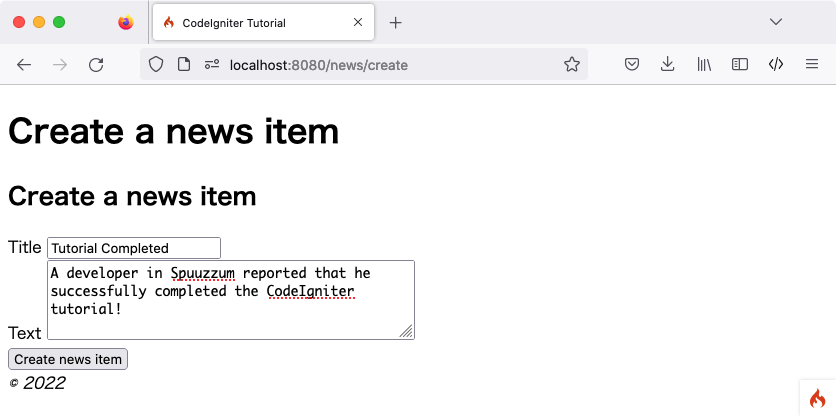

ニュースアイテムを作成する
###############################################################################

CodeIgniterを使用して、データベースからデータを読み取る方法を理解しましたが、
まだデータベースへの書き込みはしていません。このセクションでは、前に作成した 
ニュースコントローラとモデルを拡張して
この機能を追加します。

フォームの作成
-------------------------------------------------------

データベースにデータを入力するには、
保存する情報を入力できるフォームを作成する必要があります。つまり、タイトルとテキストの2つのフィールドを持つ
フォームが必要になります。モデルのタイトルから
slug(スラグ）を派生させます。新しいビューを
**app/Views/news/create.php** に作成します。

::

    <h2><?= esc($title); ?></h2>

    <?= \Config\Services::validation()->listErrors(); ?>

    <form action="/news/create" method="post">
        <?= csrf_field() ?>

        <label for="title">Title</label>
        <input type="input" name="title" /> 

        <label for="body">Text</label>
        <textarea name="body"></textarea> 

        <input type="submit" name="submit" value="Create news item" />

    </form>

見慣れないものは、おそらく2つだけです。``\Config\Services::validation()->listErrors()``  関数は
バリデーションチェックに関連する
エラーを報告するために使用されます。``csrf_field()`` 関数は、いくつかの一般的な
攻撃からの保護に役立つ、 CSRF トークンを非表示入力入力タグを生成します。

``News`` コントローラーに戻ります。ここでは2つのことを行います。
フォームが送信されたかどうか、および送信されたデータが
バリデーションルールを通過したかどうかを確認します。これを行うには、  :doc:`フォーム
バリデーション<../libraries/validation>`  ライブラリを使用します。

::

    public function create()
    {
        $model = new NewsModel();

        if ($this->request->getMethod() === 'post' && $this->validate([
                'title' => 'required|min_length[3]|max_length[255]',
                'body'  => 'required'
            ]))
        {
            $model->save([
                'title' => $this->request->getPost('title'),
                'slug'  => url_title($this->request->getPost('title'), '-', TRUE),
                'body'  => $this->request->getPost('body'),
            ]);

            echo view('news/success');
            
        }
        else
        {
            echo view('templates/header', ['title' => 'Create a news item']);
            echo view('news/create');
            echo view('templates/footer');
        }
    }

上記のコードでは多くの機能が追加されます。まず、NewsModelをロードします。
そして、``POST`` リクエストをショルするかどうかを確認し、
コントローラが提供しているヘルパー関数を使用して、
 $_POST  フィールドを検証します。この場合、タイトルとテキストのフィールドは必須項目となります。

このようにCodeIgniterには強力なバリデーションライブラリが
存在します。このライブラリの詳細は  :doc:`こちら <../libraries/validation>` を参照してください。

続いて、フォームのバリデーションチェックが正常に実行されたかどうか
が確認します。正常に通過しなかった場合は、フォームが表示されます。
**送信された項目が、すべてのバリデーションルールに合格する** とモデルが呼び出されます。 これにより
ニュース項目をモデルに渡すことができました。
これには新しい関数 ``url_title()`` が含まれています。この関数 -
:doc:`URL ヘルパー <../helpers/url_helper>` によって提供されます - 
渡した空白文字列を削除し、
すべてのスペースをダッシュ (-) で置き換え、すべてが小文字であることを確認します。これにより、URLの作成に最適な素晴らしい
slugが作成されます。

この後、ビューがロードされ、成功メッセージが表示されます。**app/Views/news/success.php** に
ビューを作成し、成功メッセージを書き込みます。

これは次のように簡単です。:

::

    ニュースアイテムの作成が成功しました！

モデルの更新
-------------------------------------------------------

最後に、
データが適切に保存されるようにモデルが設定されていることを確認します。. ``save()`` メソッドは
主キーの存在に基づいて
情報を挿入する必要があるかどうか、
またすでに存在していて更新する必要があるかどうかを決定します。このケースでは、それに渡されるIDフィールドがないので、
テーブルに **news** という新しい行を挿入します。

ただし、デフォルトではモデルの挿入および更新メソッドは、
どのフィールドを更新しても安全かわからないために
実際にはデータを保存しません。モデルを編集して、 ``$allowedFields``
プロバティに更新可能な不フィールドのリストを提供します。

::

    <?php namespace App\Models;
    use CodeIgniter\Model;

    class NewsModel extends Model
    {
        protected $table = 'news';

        protected $allowedFields = ['title', 'slug', 'body'];
    }

この新しいプロパティには
データベースに保存できるフィールドが含まれています。``id`` を省略していることに注意してください。 これはデータベースの自動インクリメントフィールドであるため
必要ありません。
これは大量の割り当ての脆弱性から守るために役立ちます。モデルがタイムスタンプを処理している場合は
それらも除外します。

ルーティング
-------------------------------------------------------

CodeIgniter アプリケーションにニュースアイテムを追加する前に、 
**app/Config/Routes.php** にルールを追加する必要があります。ファイルに以下の内容が含まれていることを確認しましょう。
含まれていることを確認しましょう。これにより CodeIgnierは確実にニュース項目のslugの代わりに、 ``作成``
``作成``をメソッドとして認識します。その他のルーティングタイプについては
:doc:`こちら </incoming/routing>` を確認してください。

::

    $routes->match(['get', 'post'], 'news/create', 'News::create');
    $routes->get('news/(:segment)', 'News::view/$1');
    $routes->get('news', 'News::index');
    $routes->get('(:any)', 'Pages::view/$1');

次にプラウザでローカル開発環境を確認します。URLに
``/news/create`` を入力しましょう、
いくつかのニュースを追加し、作成した別のページでチェックします。

.. image:: ../images/tutorial4.png
    :align: center
    :height: 415px
    :width: 45%

完成！！！
-------------------------------------------------------

最初のCodeIgniter4アプリケーションが完成しました！

次の画像は **app** フォルダーの中身です。
作成した全てのファイルが緑色で表示されています。
変更した２つのファイル（データベースとルート）は表示していません。

.. image:: ../images/tutorial9.png
    :align: left
