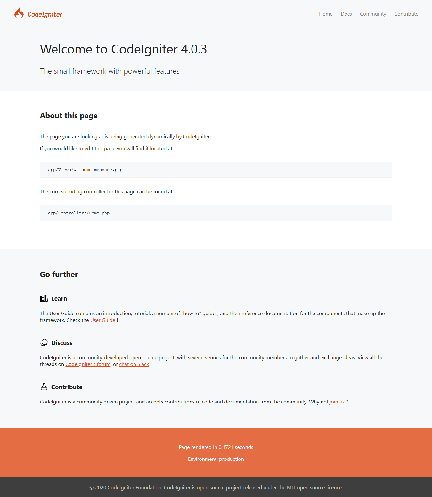
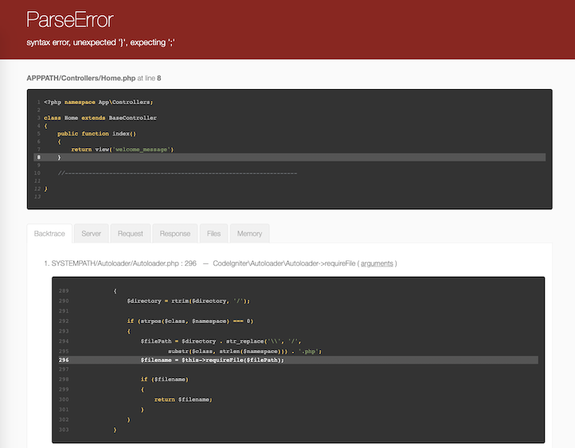

############################
Build Your First Application
############################

概要
********

このチュートリアルでは、CodeIgniter4 フレームワークを紹介します。
MVC アーキテクチャの基本原則を説明します。基本的なCodeIgniterアプリケーションは段階的にされているように
見えるでしょう。

もしPHPに慣れていない場合は、
`W3Schools PHP Tutorial <https://www.w3schools.com/php/default.asp>` を先に挑戦して見ましょう。

このチュートリアルでは **基本的なニュースアプリ**を作って見ましょう。まず、
静的ページを表示するコードを書いて見ましょう。次に、
データベースからニュース項目を読み取る部分を作ります。
最後に、フォームからデータベースにニュースを作成する部分を作ります。

このチュートリアルは主に次のことを目的としています。

-  Model-View-Controller の基本
-  Routing の基本
-  Form validation フォームバリデーション
-  CodeIgniterの "Query Builder"を利用した基本的なクエリの実行

このチュートリアルは複数のページに分かれていて、
それぞれのページでCodeIgniterフレームワークの機能の一部を説明しています。では、
次のページに進みます:

-  はじめに、このページでは何をするべきかの概要を説明します。
   まず、デェフォルトのアプリケーションを取得します。
-  :doc:`静的ページ <static_pages>`, の基本を学びます
   Controllers(コントローラー), Views(ビュー) と Routing(ルーティング）です。
-  :doc:`ニュースセクション <news_section>`, ではModelを使い始めます。
   そして、基本的なデータベース操作を行います。
-  :doc:`ニュース記事 <create_news_items>`の作成を説明します。
   データベース操作と、フォームから送信される値の検証を行います。
-  :doc:`結果 <conclusion>`、
   さらに他のリソースを読む場合の指針を与えるものとなるでしょう。、

CodeIgniterフレームワークの追究をお楽しみください。

.. toctree::
	:hidden:
	:titlesonly:

	static_pages
	news_section
	create_news_items
	conclusion

Getting Up and Running
**********************

You can download a release manually from the site, but for this tutorial we will
use the recommended way and install the AppStarter package through Composer.
From your command line type the following:

::

    composer create-project codeigniter4/appstarter ci-news

This creates a new folder, ci-news, which contains your application code, with
CodeIgniter installed in the vendor folder.

By default, CodeIgniter starts up in production mode. This is a safety feature
to keep your site a bit more secure in case settings are messed up once it is live.
So first let's fix that. Copy or rename the ``env`` file to ``.env``. Open it up.

This file contains server-specific settings. This means you never will need to
commit any sensitive information to your version control system. It includes
some of the most common ones you want to enter already, though they are all commented
out. So uncomment the line with CI_ENVIRONMENT on it, and change ``production`` to
``development``::

    CI_ENVIRONMENT = development

With that out of the way it's time to view your application in a browser. You can
serve it through any server of your choice, Apache, Nginx, etc, but CodeIgniter
comes with a simple command that takes advantage of PHP's built-in server to get
you up and running fast on your development machines. Type the following on the
command line from the root of your project::

    php spark serve

The Welcome Page
****************

Now point your browser to the correct URL you will be greeted by a welcome screen.
Try it now by heading to the following URL:

::

    http://localhost:8080

and you should be greeted by the following page:

This means that your application works and you can start making changes to it.

Debugging
*********

Now that you're in development mode, you'll see a toolbar on the bottom of your application.
This toolbar contains a number of helpful items that you can reference during development.
This will never show in production environments. Clicking any of the tabs along the bottom
brings up additional information. Clicking the X on the right of the toolbar minimizes it
to a small square with the CodeIgniter flame on it. If you click that the toolbar
will show again.

In addition to this, CodeIgniter has some helpful error pages when you hit exceptions or
other errors in your program. Open up ``app/Controllers/Home.php`` and change some line
to generate an error (removing a semi-colon or brace should do the trick!). You will be
greeted by a screen looking something like this:

There are a couple of things to note here:

1. Hovering over the red header at the top reveals a ``search`` link that will open up
   Google.com in a new tab and searching for the exception.
2. Clicking the ``arguments`` link on any line in the Backtrace will expand a list of
   the arguments that were passed into that function call.

Everything else should be clear when you see it.

Now that we know how to get started and how to debug a little, let's get started building this
small news application.
