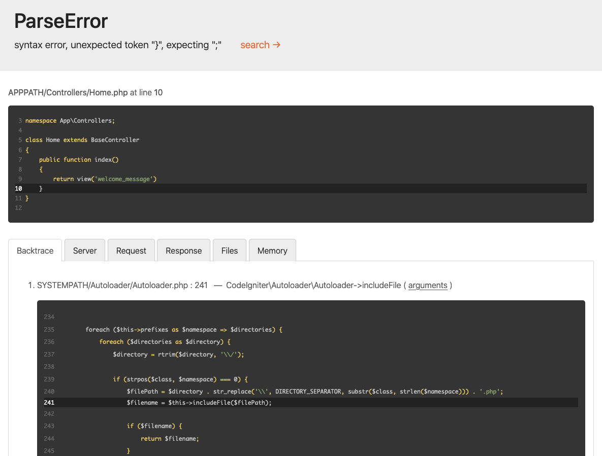

############################
はじめてのアプリケーションを作ろう
############################

概要
********

このチュートリアルでは、CodeIgniter4 フレームワークを紹介します。
MVC アーキテクチャの基本原則を説明します。基本的なCodeIgniterアプリケーションは段階的にされているように
見えるでしょう。

もしPHPに慣れていない場合は、
`W3Schools PHP Tutorial <https://www.w3schools.com/php/default.asp>`_ を先に挑戦して見ましょう。

このチュートリアルでは **基本的なニュースアプリ** を作って見ましょう。まず、
静的ページを表示するコードを書いて見ましょう。次に、
データベースからニュース項目を読み取る部分を作ります。
最後に、フォームからデータベースにニュースを作成する部分を作ります。

このチュートリアルは主に次のことを目的としています。

-  Model-View-Controller の基本
-  Routing の基本
-  Form validation フォームバリデーション
-  CodeIgniterの "Query Builder"を利用した基本的なクエリの実行

このチュートリアルは複数のページに分かれていて、
それぞれのページでCodeIgniterフレームワークの機能の一部を説明しています。では、
次のページに進みます:

-  はじめに、このページでは何をするべきかの概要を説明します。
   まず、デェフォルトのアプリケーションを取得します。
-  :doc:`静的ページ <static_pages>`, の基本を学びます
   Controllers(コントローラー), Views(ビュー) と Routing(ルーティング）です。
-  :doc:`ニュースセクション <news_section>`, ではModelを使い始めます。
   そして、基本的なデータベース操作を行います。
-  :doc:`ニュース記事 <create_news_items>`の作成を説明します。
   データベース操作と、フォームから送信される値の検証を行います。
-  :doc:`結果 <conclusion>`、
   さらに他のリソースを読む場合の指針を与えるものとなるでしょう。、

CodeIgniterフレームワークの追究をお楽しみください。

.. toctree::
	:hidden:
	:titlesonly:

	static_pages
	news_section
	create_news_items
	conclusion

起動と実行
**********************

サイトから手動でリリースされたものをダウンロードできますが、
このチュートリアルでは、推奨する方法として、composerを使ってパッケージインストールする方法ですすめていきます。
コマンドラインから次のように入力します:

::

    composer create-project codeigniter4/appstarter ci-news

ci-newsフォルダが作られます。
CodeIgniter はその中の vendor フォルダにインストールされます。

デェフォルトでは CodeIgniter は production mode (プロダクションモード)で起動しますこれは設定がめちゃくちゃになった場合に
サイトをより安全に保つための安全機能です。
なので、まずはそれを最初に修正します。.  ``env`` ファイルをコピーする、もしくは ``.env`` に名前を変更します。 それを開きます。

このファイルにはサーバ固有の設定が含まれています。このファイルは、バージョン管理システムにコミットする必要はありません。
機密情報をコミットする必要はないのです。これらはすべて
コメントアウトされていますが、入力したい一般的なものが
含まれています。そのため、 CI_ENVIRONMENT が含まれている行のコメントを外して、 ``production`` を
``development`` に変更します。::

    CI_ENVIRONMENT = development

以上で、アプリケーションをブラウザで表示できるようになりました。ApacheやNginxなど
任意のサーバーを介してサービスを提供することができますが、CodeIgniterには
PHPの組み込みサーバを利用して開発マシンですばやく起動して実行できる
コマンドが付属しています。プロジェクトのルールから
コマンドラインに次のように入力します::

    php spark serve

ウェルカムページ
****************

ブラウザに正しiURLを指定すると、ウェルカム画面が表示されます。
次のURLにアクセスして、試して見ましょう。:

::

    http://localhost:8080

そして、次のようなページを見ることができるはずです。:

.. image:: ../images/welcome.png

アプリケーションが正常に機能しました。変更を開始できる状態となりました。

デバッグ
*********

開発モードになっているので、アプリケーション下部にツールバーが表示されます。
このツールバーには、開発中に参照できるお役立ちアイテムが含まれています。
これは本番環境では表示されません。下部にあるタブをクリックすると
追加情報が表示されます。ツールバー右側にあるXをクリックすると、
CodeIgniterフレームがついた小さな正方形に最小化されます。これをクリックすると
ツールバーが再び表示されます。

これに加え、CodeIgniterにはプログラムで例外またはその他の
エラーが発生した時のためにエラーページがいくつか準備されています。``app/Controllers/Home.php`` を開き、
いくつかの行を変更してエラーを生成します（セミコロンもしくは中括弧を削除すると良いでしょう）次のような画面が
表示されます。

ここで注意するべき点がいくつかあります:

1. 上部の赤いヘッダーにカーソルを合わせると開く、  ``search``  リンクが表示されます。 
   Google.com を新しいタブで開き、例外を検索します。.
2. バックトレースの任意の行の ``引数``  のリンクをクリックするとリストが展開されます。
   その関数呼び出しに渡された引数です。

それを見ると、他のすべてがはっきりとしてくるはずです。

開始方法と、デバッグする方法がわかったので、
この小さなニュースアプリの作成を開始しましょう。
