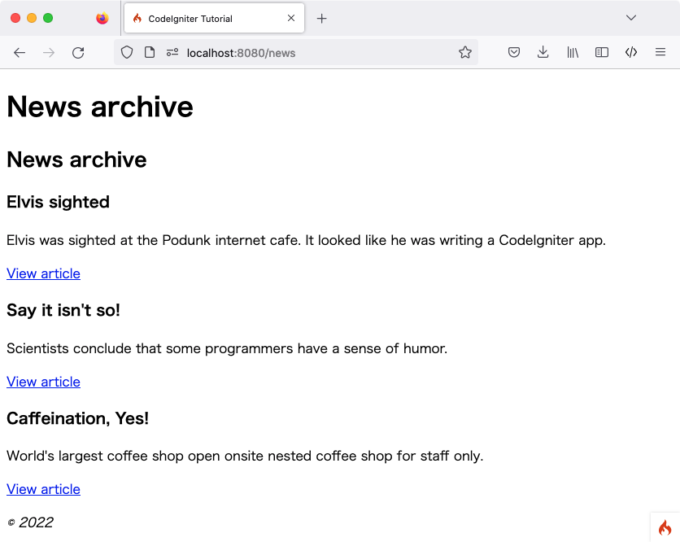

ニュースセクション
###############################################################################

前のセクションでは、静的ページを参照するクラスを作成し、
フレームワークの基本的な概念を説明しました。カスタムルーティングルールを追加して
URLをきれいにしました。次は動的なコンテンツを追加します。
そして、データベースの使用を開始します。

使用するデータベースの作成
-------------------------------------------------------

CodeIgniterのインストールでは、 :doc:`サーバー要件</intro/requirements>`.
で示されているように、適切なデータベースが存在していることを想定しています。
このチュートリアルでは、MySQLのSQLコードを提供します。
また、データベースコマンド 
を発行するための適切なクライアントがあることも前提としています。 (mysql, MySQL Workbench, or phpMyAdmin)

このチュートリアルで使用するデータベースを作成する必要があります。
そして、それを使用するようにCodeIgniterを構成します。

データベースクライアントを使用して、データベースに接続し次のSQLコマンドを実行します。(MySQL).
またいくつかのレコードを追加します。ここではテーブル作成に必要なSQLステートメントのみを示します。
CodeIgniterになれれば、プログラムでこれを実行可能なことに注意をしてください。詳しくは、
:doc:`Migrations <../dbmgmt/migration>` と
:doc:`Seeds <../dbmgmt/seeds>`  を参照してください。より便利にデーターベースを設定作成できます。

::

    CREATE TABLE news (
        id int(11) NOT NULL AUTO_INCREMENT,
        title varchar(128) NOT NULL,
        slug varchar(128) NOT NULL,
        body text NOT NULL,
        PRIMARY KEY (id),
        KEY slug (slug)
    );

注意: Web公開のコンテキストにおける  "slug" はリソースを識別および説明するためにURLで使用される
ユーザーおよびSEOフレンドリーな短いテキストです。

シードレコードは次のようになります:

::

    INSERT INTO news VALUES
    (1,'Elvis sighted','elvis-sighted','Elvis was sighted at the Podunk internet cafe. It looked like he was writing a CodeIgniter app.'),
    (2,'Say it isn\'t so!','say-it-isnt-so','Scientists conclude that some programmers have a sense of humor.'),
    (3,'Caffeination, Yes!','caffeination-yes','World\'s largest coffee shop open onsite nested coffee shop for staff only.');

データベースへ接続
-------------------------------------------------------

CodeIgniterをインストールをした時に作成したローカル設定ファイル  ``.env`` に
データベースプロバティの設定をコメント解除し、使用するデータベースにあわせて
適切に設定をする必要があります。:doc:`こちら <../database/configuration>` の説明に従って、
データベースの構成が適切であることを確認してください。

::

    database.default.hostname = localhost
    database.default.database = ci4tutorial
    database.default.username = root
    database.default.password = root
    database.default.DBDriver = MySQLi

モデルのセットアップ
-------------------------------------------------------

コントローラでデータベース操作を記述するのではなく、
クエリをモデルに配置して、再利用できるようにします。モデルは
データベースもしくは他のデータストアの情報を取得、挿入および
更新する場所です。データベースへのアクセスを提供します。
さらに詳しく知りたい場合は、 :doc:`こちら </models/model>` を読むと良いでしょう。

**app/Models/** ディレクトリを開き、**NewsModel.php**
ファイルを作成しましょう。そして次のコードを追加します。

::

    <?php namespace App\Models;

    use CodeIgniter\Model;

    class NewsModel extends Model
    {
        protected $table = 'news';
    }

このコードは以前に使用した以前に使用したコントローラのコードに似ています。``CodeIgniter\Model``  をextendして新しいモデルを作成し、
データベースライブラリを
ロードします。これはデータベースクラスを ``$this->db``  
オブジェクトを通じて利用可能にするものです。

データベースとモデルの設定ができたので、
次はデータベースから全ての投稿を取得するメソッドを用意します。これを行うには、
CodeIgniterで用意されている、データベース抽象化レイヤー 
:doc:`クエリビルダー <../database/query_builder>` を使用します。これにより、 'クエリ'を記述することで 
:doc:`サポートされているデータベースシステム  <../intro/requirements>`
で機能させることができるようになります。モデルクラスは
クエリビルダーを簡単に操作できます。
そしてデータをより簡単に操作するためのツールが用意されています。次のコードを
モデルに追加します。

::

    public function getNews($slug = false)
    {
        if ($slug === false)
        {
            return $this->findAll();
        }

        return $this->asArray()
                    ->where(['slug' => $slug])
                    ->first();
    }

このコードを利用すると、2つの異なる食えるを実行することができます。すべてのニュースレコードを取得するか、
`slug <#>`_ でニュースアイテムを取得できます。クエリを実行する前に、
``$slug`` 変数がサニタイズされていないことに気がついたかもしれません。
:doc:`クエリビルダー <../database/query_builder>`  がこれを行います。

ここで使用される2つのメソッド、 ``findAll()`` と ``first()`` は
モデルクラスによって提供されます。**NewsModel** クラスの``$table`` プロパティによって、使用するテーブルを
すでに知っています。これらは、クエリビルダーを利用して
現在のテーブルに対してコマンドを実行し、
選択した形式で結果の配列を返す補助メソッドです。この例の
``findAll()``  オブジェクトの配列を返します。

ニュースを表示する
-------------------------------------------------------

クエリの記述ができたので、モデルはユーザーにニュースアイテムを表示する
ビューに関連付けができるはずです。これは以前に作成した 
``Pages`` コントローラーで行うこともできますが、
鋭角にするために、新しく ``News``  コントローラを作成します。**app/Controllers/News.php** 
ファイルを作成します。

::

    <?php namespace App\Controllers;

    use App\Models\NewsModel;
    use CodeIgniter\Controller;

    class News extends Controller
    {
        public function index()
        {
            $model = new NewsModel();

            $data['news'] = $model->getNews();
        }

        public function view($slug = null)
        {
            $model = new NewsModel();

            $data['news'] = $model->getNews($slug);
        }
    }

コードを見ると、先ほど作成したファイルと
いくつかの類似点があることがわかります。まずコアのCodeIgniterのクラス  ``Controller`` クラスをextendします。
現在の ``Request`` と  ``Response`` オブジェクトだけではなく
これはいくつかのヘルパーメソッドを提供し、
情報をディスクに保存するために ``Logger`` クラスを提供します。

次に2つの方法があります。１つはすべてのニュース項目を表示する方法、
もう一つは特定のニュース項目を表示する方法です。2番目のメソッドで ``$slug``  変数がモデルのメソッドに
渡されていることがわかります。モデルはこの slug を利用して、
返されるニュース項目を識別しています。

これでデータはコントローラを通じてモデルを介し、取得されますが、
まだ何も表示されません。次に、
このデータをビューに渡します。 ``index()`` メソッドを次のように変更します ::

    public function index()
    {
        $model = new NewsModel();

        $data = [
            'news'  => $model->getNews(),
            'title' => 'News archive',
        ];

        echo view('templates/header', $data);
        echo view('news/overview', $data);
        echo view('templates/footer', $data);
    }

上記のコードは、モデルからすべてのニュースレコードを取得し、
それを変数に割り当てます。タイトルの値は、  ``$data['title']`` 要素にも割り当てられ、
すべてのデータがビューに渡されます。次にニュース項目をレンダリングするためのビューを
作成する必要があります。**app/Views/news/overview.php** を作成し、
次のコードを追加します。

::

    <h2><?= esc($title); ?></h2>

    <?php if (! empty($news) && is_array($news)) : ?>

        <?php foreach ($news as $news_item): ?>

            <h3><?= esc($news_item['title']); ?></h3>

            

                <?= esc($news_item['body']); ?>
            

            
<a href="/news/<?= esc($news_item['slug'], 'url'); ?>">View article</a>

        <?php endforeach; ?>

    <?php else : ?>

        <h3>No News</h3>

        
Unable to find any news for you.

    <?php endif ?>

.. 注:: XSS攻撃を防ぐために、**esc()** を使用しています。 
    しかし今回は2番目のパラメータとして "url"  も渡しています。それは
    攻撃のパターンは出力が行われるコンテキストによって異なるため、
    使用されています。これについては、 :doc:`こちら </general/common_functions>` で詳細を確認することができます。

ここでは各ニュース項目がループされ、ユーザーに表示されます。HTMLが混ざったPHPで
テンプレートを作成したことがわかります。テンプレート言語を使用したい場合、
CodeIgniterの  :doc:`View
パーサー </outgoing/view_parser>` もしくはサードパーティ製のパーサーを使用することができます。

これでニュースの概要ページは完成しましたが、
ここのニュース項目を表示するページはまだありません。前に作成したモデルは、
この機能で簡単に使用できるように作成されています。コントローラにコードを追加して
新しいビューを作成するだけになります。``News`` コントローラに戻り、次のように
``view()`` メソッドを更新します。:

::

    public function view($slug = NULL)
    {
        $model = new NewsModel();

        $data['news'] = $model->getNews($slug);

        if (empty($data['news']))
        {
            throw new \CodeIgniter\Exceptions\PageNotFoundException('Cannot find the news item: '. $slug);
        }

        $data['title'] = $data['news']['title'];

        echo view('templates/header', $data);
        echo view('news/view', $data);
        echo view('templates/footer', $data);
    }

パラメータなしで、 ``getNews()`` メソッドを呼び出す代わりに
``$slug`` 変数が渡されるので特定のニュース項目を返します。
あとは対応するビューを
**app/Views/news/view.php** に作成するだけです。次のコードを、このファイルに挿入します。

::

    <h2><?= esc($news['title']); ?></h2>
    <?= esc($news['body']); ?>

ルーティング
-------------------------------------------------------

以前に作成したワイルドカードルーティングルールのため、
作成したコントローラを表示するにはルートの追加が必要です。ルーティングファイル
(**app/Config/Routes.php**) を次のように変更します。
このリクエストが ``Pages`` コントローラに直接行くのではなく、
``News`` コントローラに到達するようにします。最初の行はURIをslug(スラグ)で
``News`` コントローラの ``view()`` メソッドにルーティングします。

::

    $routes->get('news/(:segment)', 'News::view/$1');
    $routes->get('news', 'News::index');
    $routes->get('(:any)', 'Pages::view/$1');

ブラウザでニュースページ つまり  ``localhost:8080/news`` にアクセスすると、
ニュースの項目リストが表示されます。
各ニュース項目には1つの記事を表示するためのリンクがあります。

