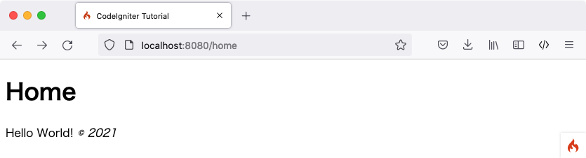

静的ページ
###############################################################################

**注:** このチュートリアルは、CodeIgniterをダウンロードし、開発環境に 
:doc:`フレームワークがインストール済み <../installation/index>`   iであることを
前提としています。

まずは静的ページを処理するように  **controller**  
を設定します。controller は単に役割を委任するだけのクラスです。
これはあなたのWebアプリケーションの接着剤の役割を果たします。

例えば次の呼び出しが行われたとします:

::

    http://example.com/news/latest/10

"news" という名前のコントローラーがあると想像してください。latestというメソッドが
呼び出されます。ニュースメソッドの仕事は10個のアイテムを取得して
ページに表示をすることです。MVCでは多くの場合
一致するURLパターンで表示されます:

::

    http://example.com/[controller-class]/[controller-method]/[arguments]

URLスキームがより複雑になると、これは変更される可能性があります。しかし、今のところ
私たちがするべきものの全てです。

はじめてのコントローラーを作ろう
-------------------------------------------------------

 **app/Controllers/Pages.php** 
にファイルを作成し、次のコードを書いてみましょう。

::

    <?php namespace App\Controllers;

    use CodeIgniter\Controller;

    class Pages extends Controller
    {
        public function index()
        {
            return view('welcome_message');
        }

        public function view($page = 'home')
        {
        }
    }

``view()`` メソッドに 引数 ``$page`` を受け入れたものを作成し、
``Pages`` という名前のクラスを作成しました。**app/Controllers/Home.php** にあるデェフォルトのコントローラーと同じ 
``index()`` メソッドもあります。
このメソッドは、CodeIgniterのウェルカムページを表示します。

``Pages`` クラスは
``CodeIgniter\Controller`` クラスを継承しています。 
これは、新しい  ``CodeIgniter\Controller`` クラス
(*system/Controller.php*)  で定義されたメソッドと変数にアクセスできることを意味します。

**controller はWebアプリケーションへの全てのリクエストの中心**
となります。他のphpで書かれるClassと同様にコントローラー 内では
``$this`` として参照されます。

最初のメソッドを作成したので、
いくつかの基本的なページテンプレートを作成します。ページフッターとヘッダーとして機能する２つの "ビュー" (ページテンプレート) を
作成します。

**app/Views/templates/header.php** を作成し
次のコードを書いて見ましょう :

::

    <!doctype html>
    <html>
    <head>
        <title>CodeIgniter Tutorial</title>
    </head>
    <body>

        <h1><?= esc($title); ?></h1>

ヘッダーはメインビューを読み込む前に表示する
基本的なHTMLコードと見出しが含まれています。またコントローラで後で定義する 
``$title`` 変数も出力をします。
次に **app/Views/templates/footer.php** を作成し、
次のコードを書いて見ましょう。:

::

        <em>&copy; 2019</em>
    </body>
    </html>

.. 　注::   **header.php** テンプレートをよく見ると、 **esc()** 
    を使用しています。これは、COdeIgniterが提供するグローバル関数であり、
    XSS 攻撃を防ぐものです。これについては、 :doc:`こちら </general/common_functions>` で詳細を確認することができます。

.. 警告:: このチュートリアルでは2つの **view()** 関数を参照しています。
    １つは ``public function view($page = 'home')`` で作成されたクラスメソッドです。
    そして ``echo view('welcome_message');``  で、ビューを表示しています。
    どちらも *技術的* 機能です。しかし、クラス関数で作成すると
    メソッドと呼ばれます。

コントローラにロジックを追加する
-------------------------------------------------------

ここまでに``view()`` メソッドを作成しました。このメソッドは
ロードされるページの名前であるパラメータを受け入れています。静的な
ページ本体は  **app/Views/pages/**
ディレクトリにあります。

そのディレクトリに  **home.php** と **about.php** を作成します。
それらのファイル内でテキスト(必要なものはなんでも）を入力し、保存します。
特に独創的に書くのでなければ、"Hello World!" で良いでしょう。 

これらのページをロードするには、
リクエストされたページが存在するかどうかを確認する必要があります。これは上で作成した、  ``Pages``  クラスの 
``view()``  メソッドの本体になります :

::

    public function view($page = 'home')
    {
        if ( !is_file(APPPATH.'/Views/pages/'.$page.'.php'))
        {
            // Whoops, we don't have a page for that!
            throw new \CodeIgniter\Exceptions\PageNotFoundException($page);
        }

        $data['title'] = ucfirst($page); // Capitalize the first letter

        echo view('templates/header', $data);
        echo view('pages/'.$page, $data);
        echo view('templates/footer', $data);
    }

これで、要求されたページが存在する場合、ヘッダーとフッターを含めてロードされ、
ユーザーに表示されます。リクエストされたページが存在しない場合には、 "404 Page not found"
エラーが表示されます。

このメソッドの最初の行では、ページが実際に存在するかどうかの確認をします。
PHPのネイティブ関数  ``is_file()``  関数を利用して
ファイルが予定されていた場所にあるかどうかを確認しています。``PageNotFoundException`` は CodeIgniter
で用意されている例外で、エラーページを表示させるために用意されています。

Iヘッダーテンプレートでは ``$title`` 変数を利用してページタイトルを
カスタマイズしました。このタイトル値はこのメソッドで定義されますが、
値を変数に割り当てる代わりに、``$data`` に
配列でタイトル要素を割り当てることができます。

最後に、表示をする順序で
ビューをロードする必要があります。これを行うには、
CodeIgniter に組み込まれている、``view()`` 関数を使用します。 ``view()`` 関数の２番目の引数は、
ビューに値を渡すものです。``$data`` 変数の値である配列の各値は
そのキーの名前を持つ変数に割り当てられます。したがって、コントローラの
``$data['title']``  の値はビューの ``$title``  
と同等です。

.. 注::  **view()** 関数に渡されるファイルとディレクトリの名前は必須です。
    実際のディレクトリとファイル自体の大文字小文字をを一致させるかはシステムが、
    そして大文字と小文字を区別するプラットフォームでは、エラーを投げますこれらについては、
    :doc:` こちら </outgoing/views>` をご確認ください。

アプリの実行
-------------------------------------------------------

テストをする準備はできましたか？組み込みサーバを利用する場合、``public``  で提供される ``.htaccess`` 
の設定を適用できないため、
URLの一部を "index.php/"  のように
アプリを実行することができませんCodeIgniterには使用できる独自のコマンドがあります。

コマンドラインから、プロジェクトのルートで実行できます:

::

    php spark serve

これは、 port 8080 でアクセス可能なWebサーバを提供します。ブラウザで ``localhost:8080`` にアクセスすると、
CodeIgniterのウェルカムページが表示されます。

ブラウザ上でいくつかURLを試して、上記で作成した ``Pages`` 
コントローラーが何を表示するか確認してみましょう。

.. table::
    :widths: 20 80

    +---------------------------------+-----------------------------------------------------------------+
    | URL                             | Will show                                                       |
    +=================================+=================================================================+
    | localhost:8080/pages            | the results from the `index` method inside our `Pages`          |
    |                                 | controller, which is to display the CodeIgniter "welcome" page, |
    |                                 | because "index" is the default controller method                |
    +---------------------------------+-----------------------------------------------------------------+
    | localhost:8080/pages/index      | the CodeIgniter "welcome" page, because we explicitly asked for |
    |                                 | the "index" method                                              |
    +---------------------------------+-----------------------------------------------------------------+
    | localhost:8080/pages/view       | the "home" page that you made above, because it is the default  |
    |                                 | "page" parameter to the ``view()`` method.                      |
    +---------------------------------+-----------------------------------------------------------------+
    | localhost:8080/pages/view/home  | show the "home" page that you made above, because we explicitly |
    |                                 | asked for it                                                    |
    +---------------------------------+-----------------------------------------------------------------+
    | localhost:8080/pages/view/about | the "about" page that you made above, because we explicitly     |
    |                                 | asked for it                                                    |
    +---------------------------------+-----------------------------------------------------------------+
    | localhost:8080/pages/view/shop  | a "404 - File Not Found" error page, because there is no        |
    |                                 | `app/Views/pages/shop.php`                                      |
    +---------------------------------+-----------------------------------------------------------------+

ルーティング
-------------------------------------------------------

コントローラーが機能しています! 

カスタムルーティングルールを使用すると、任意のURIを任意のコントローラーおよびメソッドに割り当てをし、
通常の規則から解放されます:

::

    http://example.com/[controller-class]/[controller-method]/[arguments]

まずは最初にそれを修正しましょう。まず、 **app/Config/Routes.php** にあるファイルを開き、
「ルート定義」セクションを、 
ファイルの中で探します。

最初にコメント化されていない行は次の通りです:

::

    $routes->get('/', 'Home::index');

このディレクティブは、コンテンツが指定されていない着信は 
``Home`` コントローラの ``index()`` メソッドによって処理されることを示しています。 

 '/' のルートディレクティブの **後** に次の行を追加します。

::

    $routes->get('(:any)', 'Pages::view/$1');

CodeIgniterはルーティングルールを上から下に順に読み取り、
リクエストを最初に一致したルールに割り当てます。Each rule is a regular expression
(left-side) mapped to a controller and method name separated by slashes
(right-side). When a request comes in, CodeIgniter looks for the first
match, and calls the appropriate controller and method, possibly with
arguments.

More information about routing can be found in the URI Routing
:doc:`documentation </incoming/routing>`.

Here, the second rule in the ``$routes`` array matches **any** request
using the wildcard string ``(:any)``. and passes the parameter to the
``view()`` method of the ``Pages`` class.

Now visit ``localhost:8080/home``. Did it get routed correctly to the ``view()``
method in the pages controller? Awesome!

次のような内容が表示されます。:

.. 注意:: ルーツを手動で指定する場合は無効にすることをお勧めします。
     ``$routes->setAutoRoute(false);`` に設定することで自動ルーティングを無効にします。
    これにより、定義したルートのみアクセスできるようになります。
